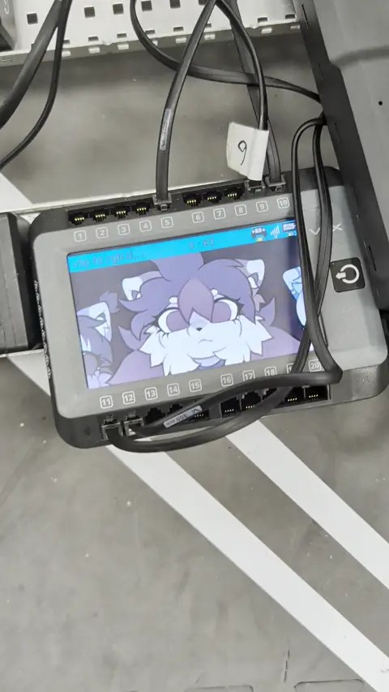

# V5 Video Player (LZ4 Streaming Player for VEX V5)

High-performance video playback on the VEX V5 Robot Brain screen (480x272 @ up to 60 FPS) with direct hardware blitting (`pros::screen::copy_area`) and ultra-fast LZ4 streaming decompression from MicroSD (`/usd/`).

## Proof of Concept

## Features
- **30–60 FPS Smooth Playback**: Minimal CPU overhead with LZ4 block decompression.
- **Direct Hardware Blitting**: Bypasses GUI object overhead using `pros::screen::copy_area()`.
- **Streaming Architecture**: Reads frame-by-frame on-demand from the SD card without consuming the Brain's RAM.
- **Background Task Support**: Non-blocking playback within a PROS background task (`pros::Task`) with asynchronous stop support.

## Structure
- `pack_yuv.py` / `v5p_player.py`: Python video encoder & desktop reference player.
- `lz4 to rgb disp + main logic/`: PROS C++ project with `include/v5p.hpp` and robot integration in `src/main.cpp`.
